# 🦈 Tubarões do Espaço | NASA Space Apps Challenge 2025

Projeto desenvolvido para o desafio **Tubarões do Espaço** do NASA Space Apps Challenge 2025.  

Nosso objetivo é **prever habitats de alimentação de tubarões** utilizando dados de satélite da NASA (SST, PACE, SWOT, ECCO).  
O projeto une **modelagem matemática, machine learning e visualização interativa**, além da proposta de um **conceito de tag eletrônica** para tubarões.

---

## 🚀 Resumo Executivo

Este projeto usa **dados de satélite da NASA** para entender a relação entre **condições oceânicas e habitats de tubarões**, principais predadores marinhos.  
Combinamos **ciência oceânica, inteligência artificial e novas tecnologias** para:  
- Prever **onde tubarões estarão se alimentando**.  
- Propor **tags inteligentes** que medem não só *onde* estão, mas também *o que comem*.  
- Fornecer **mapas interativos** para cientistas, gestores ambientais e sociedade.

---

## 🌍 Impacto Esperado

- 🌱 **Conservação marinha**: proteção de habitats críticos.  
- 🎣 **Pesca sustentável**: reduzir conflitos entre pesca e biodiversidade.  
- 🧑‍🎓 **Educação científica**: engajar estudantes e comunidade em ciência oceânica.  
- 🛰️ **Valorização dos dados da NASA**: aproximar ciência espacial de problemas ambientais.  

---

## 📂 Estrutura do Projeto

```
Tubaroes_do_Espaco/
│
├── config/               # Configurações do projeto
│   └── config.yaml       # Parâmetros gerais (bbox, datas, nomes de datasets)
│
├── data/
│   ├── raw/              # Dados brutos baixados da NASA (NetCDF .nc)
│   ├── processed/        # Dados pré-processados (recorte, gradiente, etc.)
│   └── features/         # Dados tabulares para ML (lat, lon, variáveis ambientais)
│
├── scripts/              # Scripts principais da pipeline
│   ├── 01_search_download.py     # Busca e download dos dados via earthaccess
│   ├── 02_preprocess.py          # Pré-processamento: recorte + gradiente SST
│   ├── 03_feature_engineering.py # Transformação em dataset tabular
│   ├── 04_train_model.py         # Treinamento de modelo preditivo (ML)
│   ├── 05_export_tiles.py        # Exportação em mapas/tiles para visualização
│   ├── check_processed.py        # Pré-visualização em PNG
│   └── check_processed_interactive.py # Visualização interativa em HTML
│
├── app/                  # (futuro) Web app interativo (Leaflet/MapLibre)
│
├── .venv/                # Ambiente virtual Python
└── requirements.txt      # Dependências do projeto
```

---

## 📊 Comparação dos Conjuntos de Dados da NASA

| Dataset | Variável Principal | Resolução Espacial / Temporal | Por que é importante para tubarões? | Uso no modelo |
|---------|-------------------|-------------------------------|--------------------------------------|---------------|
| **SST (MUR)** | 🌡️ Temperatura da Superfície do Mar | ~1 km / diário | Define preferências térmicas e frentes oceânicas (hotspots de caça). | Base principal para identificar frentes térmicas. |
| **MODIS L3 CHL** | 🟢 Clorofila-a (biomassa fitoplâncton) | ~4 km / diário-semanal | Indica produtividade biológica (cadeia alimentar: plâncton → peixes → tubarões). | Variável biológica chave para prever disponibilidade de presas. |
| **PACE OCI** | 🌈 Composição do fitoplâncton (cores do oceano) | ~1 km / diário | Diferencia tipos de plâncton (nutritivos vs tóxicos). | Enriquecimento do modelo, explicando qualidade da comida disponível. |
| **ECCO (u/v correntes)** | 🌀 Correntes oceânicas (u/v) | ~10–20 km / horário-diário | Transporta nutrientes e presas; tubarões usam correntes para migração. | Adiciona dinâmica ao modelo (não só condição estática). |
| **SWOT** | 🌊 Topografia da superfície / Redemoinhos | ~1 km / repetição 21 dias | Detecta estruturas de mesoescala (eddies) que concentram alimento. | Identifica hotspots estruturais que atraem predadores. |

---

## 🌐 Cadeia Trófica e Relação com os Dados NASA

```text
🌱 Fitoplâncton (PACE / MODIS) 
   ↓
🐟 Peixes pequenos (transportados pelas correntes - ECCO) 
   ↓
🌀 Redemoinhos / frentes oceânicas (SWOT + gradiente SST)
   ↓
🦈 Tubarões (modelados via ML com base nessas variáveis)
```

---

## 🧑‍💻 O que cada script faz

- **01_search_download.py**  
  Faz login no **Earthdata**, busca datasets da NASA e baixa os arquivos para `data/raw/`.  
  ✅ Já funcionando para SST MUR (temperatura da superfície).

- **02_preprocess.py**  
  Lê arquivos de `data/raw/`, recorta pela área de interesse (`bbox`) e calcula variáveis derivadas (ex: gradiente térmico → frentes oceânicas).  
  Salva em `data/processed/`.

- **03_feature_engineering.py**  
  Converte dados processados em um dataset tabular (`.csv` ou `.parquet`) com variáveis ambientais por ponto (lat, lon, tempo).  
  Esse dataset alimenta o modelo de machine learning.

- **04_train_model.py**  
  Treina modelos de predição de hotspots de tubarões.  
  - Baseline: regressão logística  
  - Principal: XGBoost ou Random Forest  
  - Avaliação: AUC, PR, Hit@20%

- **05_export_tiles.py**  
  Exporta predições para mapas (GeoTIFF ou tiles web), para visualização em **Leaflet/MapLibre**.

---

## 🌍 Fontes Oficiais dos Dados

Para garantir reprodutibilidade, aqui estão os pontos oficiais de acesso:

- **🌡️ MUR SST (Sea Surface Temperature)**  
  Dataset: *MUR-JPL-L4-GLOB-v4.1*  
  [🔗 Navegar nos arquivos (PO.DAAC / Earthdata)](https://cmr.earthdata.nasa.gov/virtual-directory/collections/C1996881146-POCLOUD)  

- **🌱 MODIS L3 Clorofila (Chlorophyll-a, NRT)**  
  Dataset: *MODIS-Aqua Level 3 Chl-a*  
  🔗 [link oficial em breve]

- **🌊 ECCO (correntes oceânicas u/v)**  
  Dataset: *ECCO Ocean Circulation*  
  🔗 [link oficial em breve]

- **🔬 PACE OCI (Ocean Color Instrument)**  
  Dataset: *PACE OCI*  
  🔗 [link oficial em breve]

- **📡 SWOT (Sea Surface Height)**  
  Dataset: *SWOT L2/L3*  
  🔗 [link oficial em breve]

---

## 🛠️ Stack Tecnológica

- **Linguagem**: Python 3.13  
- **Bibliotecas**: xarray, numpy, pandas, scikit-learn, xgboost, matplotlib, seaborn, plotly, earthaccess  
- **Visualização**: Leaflet / MapLibre (web app interativo)  
- **Dados NASA**: PACE, SWOT, ECCO, MODIS, MUR SST  

---

## 📊 Pipeline do Projeto

```mermaid
flowchart LR
    A[Dados NASA] --> B[01 Download]
    B --> C[02 Pré-processamento]
    C --> D[03 Feature Engineering]
    D --> E[04 Treinamento ML]
    E --> F[05 Exportação Maps]
    F --> G[Web App Interativo]
```



---

## 🔧 Configuração do Ambiente

### 1. Criar ambiente virtual
```powershell
python -m venv .venv
.\.venv\Scripts\Activate.ps1
```

### 2. Instalar dependências
```powershell
pip install -r requirements.txt
```

### 3. Configurar credenciais Earthdata
Criar arquivo `_netrc` em `C:\Users\<usuario>\_netrc`:

```
machine urs.earthdata.nasa.gov
login SEU_USUARIO
password SUA_SENHA
```

---

## 🚀 Como rodar a pipeline

1. **Baixar dados brutos**  
   ```powershell
   python scripts/01_search_download.py
   ```

2. **Pré-processar**  
   ```powershell
   python scripts/02_preprocess.py
   ```

3. **Gerar features**  
   ```powershell
   python scripts/03_feature_engineering.py
   ```

4. **Treinar modelo**  
   ```powershell
   python scripts/04_train_model.py
   ```

5. **Exportar mapas**  
   ```powershell
   python scripts/05_export_tiles.py
   ```

---

## 📊 Status Atual (Kanban)

- ✅ Download de dados (SST MUR)  
- ✅ Pré-processamento (recorte + gradiente SST)  
- ✅ Visualização estática (PNG) e interativa (HTML)  
- 🟡 Feature engineering (em andamento)  
- ⚪ ML model (pendente)  
- ⚪ Visualização em mapas (pendente)  
- ⚪ Tag eletrônica (pendente)  

---

## 🌐 Storytelling Final

Tubarões são **embaixadores da saúde oceânica**.  
Este projeto traduz a ciência de satélites em uma **ferramenta prática de conservação**, unindo tecnologia espacial e impacto humano.  
Com os dados da NASA, podemos **entender, prever e proteger** os maiores predadores do oceano — e, ao mesmo tempo, **preservar o equilíbrio da vida marinha**.  
