# 🦈 Tubarões do Espaço | NASA Space Apps Challenge 2025

Projeto desenvolvido para o desafio **Tubarões do Espaço** do NASA Space Apps Challenge 2025.  

Nosso objetivo é **prever habitats de alimentação de tubarões** utilizando dados de satélite da NASA (SST, PACE, SWOT, ECCO).  
O projeto une **modelagem matemática, machine learning e visualização interativa**, além da proposta de um **conceito de tag eletrônica** para tubarões.

---

## 🚀 Resumo Executivo

Este projeto usa **dados de satélite da NASA** para entender a relação entre **condições oceânicas e habitats de tubarões**, principais predadores marinhos.  
Combinamos **ciência oceânica, inteligência artificial e novas tecnologias** para:  
- Prever **onde tubarões estarão se alimentando**.  
- Propor **tags inteligentes** que medem não só *onde* estão, mas também *o que comem*.  
- Fornecer **mapas interativos** para cientistas, gestores ambientais e sociedade.

---

## 🌍 Impacto Esperado

- 🌱 **Conservação marinha**: proteção de habitats críticos.  
- 🎣 **Pesca sustentável**: reduzir conflitos entre pesca e biodiversidade.  
- 🧑‍🎓 **Educação científica**: engajar estudantes e comunidade em ciência oceânica.  
- 🛰️ **Valorização dos dados da NASA**: aproximar ciência espacial de problemas ambientais.  

---

## 🗂️ Estrutura principal
```
Tubaroes_do_Espaco/
│
├── config/
│   └── config.yaml                # BBox, janela temporal, datasets
│
├── data/
│   ├── raw/                      # NetCDF brutos (MUR SST etc.)
│   ├── processed/                # NetCDF recortados, dataset.csv, modelo, métricas
│   ├── features/                 # CSVs tabulares para ML
│   ├── tiles/                    # GeoTIFFs hotspots_probability_*.tif + tiles_manifest.json
│   └── compare/                  # PNG/HTML para storytelling
│
├── scripts/
│   ├── 01_search_download.py     # Download via earthaccess (usa config)
│   ├── 02_preprocess.py          # Recorte + gradiente (preserva `time`)
│   ├── 03_feature_engineering.py # Converte _proc.nc em lat/lon/date
│   ├── 04_train_model.py         # Agrega features, rotula hotspots e treina XGBoost
│   ├── 05_export_tiles.py        # Aplica o modelo e gera GeoTIFFs
│   ├── utils/                    # load_config, project_root, build_tiles_manifest.py
│   └── visualization/            # Inspeções (PNG/HTML) e comparações MODIS × modelo (--date)
│
├── app/                          # Mapa Leaflet (dropdown carrega o manifest JSON)
├── docs/                         # Briefing, visão geral e guia rápido da equipe
└── tag/                          # Conceito de tag embarcada
```
---

## 🧰 Pipeline
- **01_search_download.py** – faz login no Earthdata (`~/.netrc`) e baixa os granules conforme `config.yaml`.
- **02_preprocess.py** – recorta pela bbox, converte SST para °C, calcula gradiente (mantém dimensão temporal) e salva `_proc.nc`.
- **03_feature_engineering.py** – gera tabelas (lat, lon, date, sst, sst_gradient) em `data/features/`.
- **04_train_model.py** – concatena as tabelas, rotula hotspots (top-N% gradiente por data), treina XGBoost e grava `dataset.csv`, `model_xgb.pkl`, `metrics.json`.
- **05_export_tiles.py** – aplica o modelo a cada `_proc.nc` e exporta GeoTIFFs `hotspots_probability_*.tif` em `data/tiles/`.
- **scripts/utils/build_tiles_manifest.py** – produz `data/tiles/tiles_manifest.json`, alimentando o app Leaflet.
- **visualization/** – scripts para verificações rápidas (PNG/HTML) e comparações MODIS / SST / gradiente / probabilidade (incluindo dashboards interativos).

---

## 🛰️ Conjuntos de dados NASA
| Dataset | Variável Principal | Resolução Espacial / Temporal | Por que é importante para tubarões? | Uso no modelo |
|---------|-------------------|-------------------------------|--------------------------------------|---------------|
| **SST (MUR)** | 🌡️ Temperatura da Superfície do Mar | ~1 km / diário | Define preferências térmicas e frentes oceânicas (hotspots de caça). | Base principal para identificar frentes térmicas. |
| **MODIS L3 CHL** | 🟢 Clorofila-a (biomassa fitoplâncton) | ~4 km / diário-semanal | Indica produtividade biológica (cadeia alimentar: plâncton → peixes → tubarões). | Variável biológica chave para prever disponibilidade de presas. |
| **PACE OCI** | 🌈 Composição do fitoplâncton (cores do oceano) | ~1 km / diário | Diferencia tipos de plâncton (nutritivos vs tóxicos). | Enriquecimento do modelo, explicando qualidade da comida disponível. |
| **ECCO (u/v correntes)** | 🌀 Correntes oceânicas (u/v) | ~10–20 km / horário-diário | Transporta nutrientes e presas; tubarões usam correntes para migração. | Adiciona dinâmica ao modelo (não só condição estática). |
| **SWOT** | 🌊 Topografia da superfície / Redemoinhos | ~1 km / repetição 21 dias | Detecta estruturas de mesoescala (eddies) que concentram alimento. | Identifica hotspots estruturais que atraem predadores. |

---

## 🌍 Fontes Oficiais dos Dados

Para garantir reprodutibilidade, aqui estão os pontos oficiais de acesso:

- **🌡️ MUR SST (Sea Surface Temperature)**  
  Dataset: *MUR-JPL-L4-GLOB-v4.1*  
  [🔗 Navegar nos arquivos (PO.DAAC / Earthdata)](https://cmr.earthdata.nasa.gov/virtual-directory/collections/C1996881146-POCLOUD)  

- **🌱 MODIS L3 Clorofila (Chlorophyll-a, NRT)**  
  Dataset: *MODIS-Aqua Level 3 Chl-a*  
  🔗 [link oficial em breve]

- **🌊 ECCO (correntes oceânicas u/v)**  
  Dataset: *ECCO Ocean Circulation*  
  🔗 [link oficial em breve]

- **🔬 PACE OCI (Ocean Color Instrument)**  
  Dataset: *PACE OCI*  
  🔗 [link oficial em breve]

- **📡 SWOT (Sea Surface Height)**  
  Dataset: *SWOT L2/L3*  
  🔗 [link oficial em breve]

---

## 🛠️ Stack Tecnológica

- **Linguagem**: Python 3.13  
- **Bibliotecas**: xarray, numpy, pandas, scikit-learn, xgboost, matplotlib, seaborn, plotly, earthaccess  
- **Visualização**: Leaflet / MapLibre (web app interativo)  
- **Dados NASA**: PACE, SWOT, ECCO, MODIS, MUR SST  

## 🌐 Cadeia trófica (inspiração)
```
🌱 Fitoplâncton (PACE / MODIS)
   ↓
🐟 Peixes (correntes ECCO)
   ↓
🌀 Frentes / redemoinhos (SWOT + gradiente SST)
   ↓
🦈 Tubarões (modelados via ML)
```

---

## 📊 Pipeline do Projeto

```mermaid
flowchart LR
    A[Dados NASA] --> B[01 Download]
    B --> C[02 Pré-processamento]
    C --> D[03 Feature Engineering]
    D --> E[04 Treinamento ML]
    E --> F[05 Exportação Maps]
    F --> G[Web App Interativo]
```



---

## ⚙️ Configuração do ambiente
```powershell
# 1. Ambiente virtual
python -m venv .venv
.\.venv\Scripts\Activate.ps1
pip install -r requirements.txt

# 2. Credenciais Earthdata (~/.netrc)
#   machine urs.earthdata.nasa.gov
#   login SEU_USUARIO
#   password SUA_SENHA
```

## ▶️ Como rodar a pipeline
```powershell
python scripts/01_search_download.py
python scripts/02_preprocess.py
python scripts/03_feature_engineering.py
python scripts/04_train_model.py
python scripts/05_export_tiles.py
python scripts/utils/build_tiles_manifest.py
```

## 🗺️ App web (Leaflet)
```powershell
python -m http.server 8000
# abrir http://localhost:8000/app/index.html
```
Dropdown lista as datas do manifest e o botão alterna a escala (viridis ⇄ inferno).

---

## 📸 Visualizações úteis
- `scripts/visualization/compare_probability_vs_truecolor.py --date YYYY-MM-DD`
- `scripts/visualization/compare_probability_vs_truecolor_interactive.py --date YYYY-MM-DD`
- `scripts/visualization/compare_side_by_side_slider.py`

---

### Status (2025-09-30)
- ✅ Download (SST MUR, intervalo configurável)
- ✅ Pré-processamento (gradiente com `xarray`, preservando `time`)
- ✅ Feature engineering tabular
- ✅ Treino baseline (XGBoost, métricas em `data/processed/metrics.json`)
- ✅ Export GeoTIFFs + manifest (`data/tiles/*.tif`, `tiles_manifest.json`)
- 🟡 Integração de variáveis adicionais (CHL, correntes, SWOT)
- ⚪ Tag eletrônica (design conceitual, falta protótipo)

## 📌 Próximos passos
- Integrar CHL (MODIS/PACE), correntes (ECCO) e SWOT ao pipeline (02→03→04).
- Refinar o rótulo com dados de presença/ausência reais (telemetria, pesca, observações).
- Adicionar retries/cache nos downloads MODIS (WMS) e testes automatizados (arquivos de amostra).
- Evoluir o conceito da tag para protótipo físico.

---

## 🌐 Storytelling Final

Tubarões são **embaixadores da saúde oceânica**.  
Este projeto traduz a ciência de satélites em uma **ferramenta prática de conservação**, unindo tecnologia espacial e impacto humano.  
Com os dados da NASA, podemos **entender, prever e proteger** os maiores predadores do oceano — e, ao mesmo tempo, **preservar o equilíbrio da vida marinha**.  
